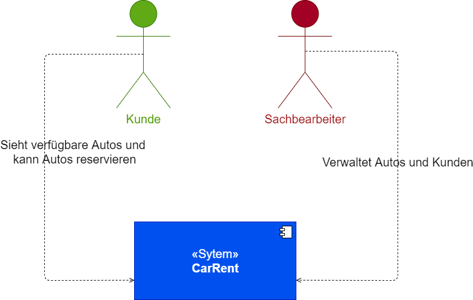

# 01-Introduction and Goals

## Overview

Es soll ein neues Autovermietungssystem „CarRent“ erstellt werden.
Das System soll aus Server-Teilen und optional einen Web-Client bestehen.

1. Die Daten sollen mittels «Repository Pattern» in eine Datenbank gespeichert werden können. 
2. Die Business Logik soll auf dem Backend laufen und REST APIs anbieten. 
3. Es soll zuerst ein Monolith erstellt werden und später auf eine Micro Service Architektur überführt werden.
4. (Optional) Der Web-Client benutzt die REST API um die Funktionen auszuführen.

## Requirements Overview

Folgende Anforderungen wurde seitens Kunden festgelegt.

Nr  | Role           | Anforderung
--- | -------------- | -----------------------------------------------------------------------------------------------------------------------------------------------------------------------
001 | Sachbearbeiter | Der Sachbearbeiter muss Kunden mit den Basis CRUD Operationen verwalten können
002 | Sachbearbeiter | Der Sachbearbeiter muss Kunden mit dessen Namen im System suchen können
003 | Sachbearbeiter | Der Sachbearbeiter muss Fahrzeuge mit den Basis CRUD Operationen verwalten können
004 | Sachbearbeiter | Der Sachbearbeiter muss ein Fahrzeug den folgenden Typen zuordnen können Luxusklasse, Mittelklasse, Einfachklasse (Klassen können ergänzt werden bzw. verwaltet werden)
005 | Sachbearbeiter | Der Sachbearbeiter muss jeder Klasse eine Tagesgebühr hinterlegen können
006 | Sachbearbeiter | Der Sachbearbeiter muss jede Reservation einsehen und mit CRUD Operationen verwalten können
007 | Sachbearbeiter | Der Sachbearbeiter muss bei Reservationen sobald das Fahrzeug abgeholt wurde den Status auf Vermietet setzen
008 | System         | Das System muss anhand der Mietdauer eines Fahrzeuges und deren ausgewählten klasse die Gesamtkosten berechnen
009 | System         | Ein Fahrzeug muss folgende Informationen besitzen, Marke, Typ, eindeutige Identifikation und Klasse
010 | System         | Jede Klasse besitzt eine Tagesgebühr
011 | System         | Status der Auto wird auf "Reserviert" gesetzt, sobald der Kunder das Auto reserviert hat
012 | Kunde          | Ein Kunde kann ein Fahrzeug anhand der Klasse suchen
013 | Kunde          | Ein Kunde muss bei einer Reservation das gewünschte Start und End Datum angeben
014 | Kunde          | Der Kunde erhält bei einer abgeschlossenen Reservation eine Reservationsnummer
015 | Kunde          | Der Kunde sieht vor der Reservation die Gesamtkosten

## Quality Goals

1. Die Anwendung muss anpassbar sein damit auch zukünftige und neue Mietvorgänge abgebildet werden können
2. Die Wartbarkeit und Skallierbarkeit müssen gewährleistet.

## Stakeholders

Role           | Name           | Expectations
-------------- | -------------- | ---------------------------------------------------------------------------
Sachbearbeiter | Contact        | System zur verwaltung der Vermietungen
Kunde          | Contact        | Einfache möglichkeit um Autos zu mieten und den Prozess schnell abzuwickeln
Entwickler     | Ricardo Coelho | Entwickelt und Designed das System
